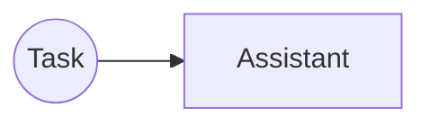
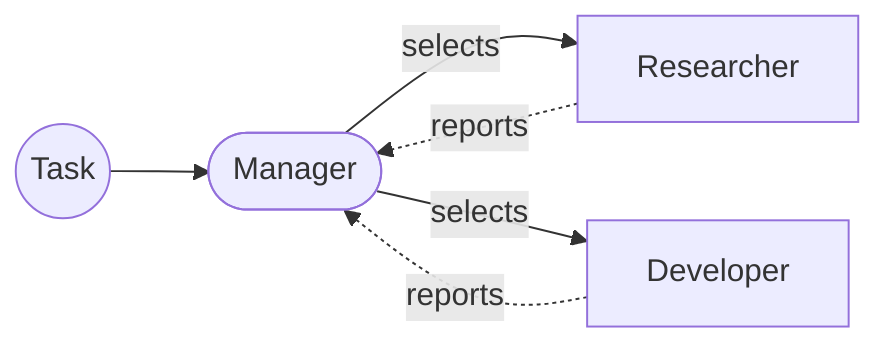

# fuseraft


fuseraft orchestrates teams of AI agents and mechanically enforces that they did what they claim to have done before the pipeline can advance.

Agents write confident prose. An agent might say "I implemented the feature" without ever calling `write_file`. "All tests pass" without running a command. Without enforcement, a pipeline advances on claims rather than facts. fuseraft blocks handoffs unless real evidence is on disk: routing validators inspect tool-call records, verify file presence, and check shell exit codes. Claims are not evidence. Artifacts and command results are.

You define a pipeline in YAML: agents, a routing strategy, and the mechanical contracts each agent must satisfy to hand off. fuseraft runs the loop, enforces the contracts, and accumulates durable knowledge across sessions — architecture decisions, a structural index of the codebase, provenance-tracked claims, and long-horizon objectives — so agents grow more informed over time rather than starting cold each run.

Works with Anthropic, xAI, OpenAI, Azure OpenAI, Ollama, and any OpenAI-compatible provider. Agents can be local or remote — the [A2A protocol](https://a2a-protocol.org/) lets you federate agent slots to independently deployed services. Built on [Microsoft Agent Framework](https://github.com/microsoft/agents).

---

## Pipeline topologies

Pipelines range from a single task-routed assistant:



...to multi-agent workflows with conditional keyword routing and anti-hallucination validators enforced at every handoff:


...to declarative directed-graph pipelines where back-edges express review cycles without duplicating states:


...to parallel fan-out/fan-in where a coordinator spawns concurrent workers that merge into a single downstream node:


...to fully autonomous [Magentic](https://arxiv.org/abs/2411.04468) orchestration where a Manager dynamically selects agents and collects their reports:



...to adversarial pipelines where generator agents produce artifacts and critic agents review them with fresh, isolated context windows — no shared history, no inherited blind spots:


---

## Quick start

```bash
# Open an interactive REPL session — no config needed
fuseraft

# Interactive wizard — describe your use case and get a config back
fuseraft init

# Or start from a built-in template
fuseraft init --template dev-team --model claude-sonnet-4-6
fuseraft init --template graph          # directed-graph pipeline with parallel fan-out
fuseraft init --template adversarial    # GAN-style generate → critique → revise pipeline
fuseraft init --template designer       # AI-assisted config designer

# Run a session
fuseraft run -c .fuseraft/config/orchestration.yaml "Build a REST API in Go with JWT authentication"

# Anchor all agents to a spec file as the authoritative source of truth
fuseraft run --spec spec.md
fuseraft run -c .fuseraft/config/orchestration.yaml --spec spec.md "Implement the specification"

# Resume the most recent incomplete session
fuseraft run --resume

# Validate a config — add --diagram for a Mermaid flowchart preview
fuseraft validate .fuseraft/config/orchestration.yaml --diagram
```

---

## Install

Prebuilt binaries are self-contained — no .NET installation required.

**Linux / macOS**

```bash
curl -fsSL https://raw.githubusercontent.com/fuseraft/fuseraft-cli/main/install.sh | bash
```

Add `--system` to install to `/usr/local/bin` instead of `~/.local/bin`:

```bash
curl -fsSL https://raw.githubusercontent.com/fuseraft/fuseraft-cli/main/install.sh | bash -s -- --system
```

**Windows (PowerShell)**

```powershell
irm https://raw.githubusercontent.com/fuseraft/fuseraft-cli/main/install.ps1 | iex
```

Both scripts download the latest release from [GitHub Releases](https://github.com/fuseraft/fuseraft-cli/releases), place the binary on your `PATH`, and confirm with a `fuseraft --version` on completion.

**Manual download**

Grab the archive for your platform from [Releases](https://github.com/fuseraft/fuseraft-cli/releases), extract the binary, and place it on your `PATH`.

**Updates**

Once installed, keep fuseraft current with:

```bash
fuseraft update          # download and install the latest release
fuseraft update --check  # check without installing
```

On Windows, `fuseraft update` launches a separate `fuseraft-update.exe` process (included in the release archive) that waits for running fuseraft instances to exit before replacing the binary. On Linux and macOS the replacement is atomic and happens in place.

**Build from source**

Requires the [.NET 10 SDK](https://dot.net):

```bash
./build.sh          # Linux / macOS
.\build.ps1         # Windows
```

The binary lands in `./bin/`.

---

## Features

**Enforcement**
- Routing validators block handoffs unless real evidence is present on disk — `RequireBrief`, `RequireWriteFile`, `RequireShellPass`, `TestReportValid`, and others verify disk artifacts and tool-call records, not agent assertions
- Change tracking records every `write_file`, `shell_run`, and `git_commit` call to a tamper-evident JSONL log; downstream agents and validators read the log, not the conversation
- Evidence contracts gate transitions with reusable predicate chains: `FileExists`, `FilesWritten`, `CommandSucceeded`, `TestReport`
- Compaction grounding cross-references `changes.json` when summarizing old turns — fabricated claims that contradict the log are corrected at compaction time rather than baked into the summary
- `HandoffContext` on transitions injects targeted artifact snapshots at the moment a handoff fires, so receiving agents see only what they need

**Orchestration**
- Nine routing modes: sequential, round-robin, keyword, structured (JSON-field routing), state machine, declarative directed graph (with parallel fan-out/fan-in), LLM-based selection, fully autonomous Magentic, and adversarial generate→critique→revise
- Saga orchestration wraps any pipeline with compensating rollback if a step fails
- Declare agents inline or as standalone `AgentFile` YAML — reuse and version agent definitions across configs
- Mix any combination of LLM providers within a single pipeline
- Federate agent slots to remote services via the [A2A protocol](https://a2a-protocol.org/) — remote agents participate identically to local ones

**Knowledge**
- Accumulates durable cross-session knowledge: architecture decisions (ADRs), a structural repository graph, provenance-tracked claims, repository memory patterns, and long-horizon objectives
- Agents query the knowledge layer through plugin tools (`decision_*`, `graph_*`, `objective_*`); the context broker ranks and injects relevant knowledge at session start without blowing the context budget
- Architecture drift detection (`fuseraft arch check`) validates source files against declared layer boundaries
- Knowledge lifecycle GC (`fuseraft knowledge gc`) archives superseded ADRs, decays stale provenance claims, and prunes orphaned graph nodes

**Tools**
- Built-in plugins: filesystem, shell, git, HTTP, JSON, search, Docker code sandboxes, persistent scratchpad, and a shared agent chatroom
- Connect any MCP server — its tools are automatically registered and available to agents
- Skills packages bundle reusable agent procedures; fuseraft auto-curates skills from qualifying sessions and injects relevant ones at session start via a full-text index

**Reliability**
- Checkpoints after every turn — sessions can always be resumed exactly where they left off
- Token tracking per turn; enforce per-model context caps and a session-wide hard spending limit
- Conversation compaction keeps long sessions within context window limits without losing grounding
- Per-agent `Context` spec — declare exactly which artifact sources each agent receives; when set, history replay is skipped entirely and context cost is proportional to what you declare

**Governance**
- Per-agent execution rings, prompt injection detection, circuit breaker, and a hash-chain audit log
- Sandbox file and shell access to a configured directory tree
- Human-in-the-loop support at any point in a pipeline

**Developer experience**
- Browser-based DevUI (`--devui`) for real-time session visualization
- Interactive Orchestration Designer (`fuseraft init --template designer`) — describe your use case, get a validated config back
- VS Code extension with CodeLens, IntelliSense, and a session viewer

---

## Documentation

| Doc | What it covers |
|-----|----------------|
| [Getting Started](docs/getting-started.md) | Prerequisites, build, first run |
| [CLI Reference](docs/cli-reference.md) | All commands and flags |
| [Configuration](docs/configuration.md) | Full config schema (YAML and JSON) |
| [Models & Providers](docs/models.md) | Model configuration and provider auto-detection |
| [Plugins](docs/plugins.md) | All built-in tools agents can call |
| [Strategies](docs/strategies.md) | Selection and termination strategies |
| [Routing Validators](docs/validators.md) | Anti-hallucination handoff guards |
| [Harness Engineering](docs/harness-engineering.md) | Designing configs that enforce real progress mechanically |
| [MCP Integration](docs/mcp.md) | Connecting external MCP servers |
| [Security & Sandbox](docs/security.md) | File and network containment |
| [Governance](docs/governance.md) | Execution rings, audit log, circuit breaker, SLO tracking |
| [Context Store](docs/context-store.md) | Importing files and directories into the session context |
| [Sessions](docs/sessions.md) | Resumption, HITL, cost tracking, compaction |
| [Knowledge Layer](docs/knowledge.md) | ADR registry, repository graph, provenance, objectives, context broker |
| [Skills](docs/skills.md) | Portable skill packages, skill curation, and the cross-session skill index |
| [Examples](docs/examples.md) | Ready-to-use config examples |
| [Design](docs/design.md) | Architecture, layer map, MAF usage, and decision log |

---

## VS Code Extension

The [fuseraft VS Code extension](https://github.com/fuseraft/fuseraft-vscode) brings the full CLI experience into your editor.

**Activity bar panel** — four persistent views:
- **Run Task** — compose a task, pick a config, set flags (`--hitl`, `--tools`, `--verbose`, `--devui`), and launch. Each task opens in its own named terminal; multiple tasks can run simultaneously.
- **Sessions** — lists sessions scoped to your workspace with status, age, and task preview. Click to resume; preview icon opens a formatted transcript with per-turn token usage and cost.
- **Configs** — auto-discovers every fuseraft config in your workspace. Click to open, or hit **+** to run the Initialize Config wizard.
- **Context** — manages reference material agents can access during sessions. Import files or folders; they're stored in `.fuseraft/context/` and available to any session in the workspace.

**CodeLens on config files** — three inline actions appear above the first line of any config:

```
▶ Run Task   ✓ Validate   ⎇ Diagram
```

**Task files** — right-click any `.md` or `.txt` file in the explorer or editor to run it directly as a fuseraft task.

**REPL** — `fuseraft: Open REPL` starts an interactive single-agent chat session without a config file.

**YAML / JSON IntelliSense** — full JSON Schema for fuseraft configs ships with the extension. Autocomplete, inline docs, and validation for every field.

**Status bar** — a persistent `fuseraft` button always visible at the bottom of the editor.

---

## Contributing

Contributions are welcome — bug fixes, new plugins, config examples, documentation, and new ideas. See [CONTRIBUTING.md](CONTRIBUTING.md) to get started.

---

## License

MIT
