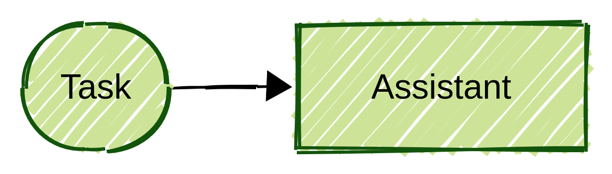
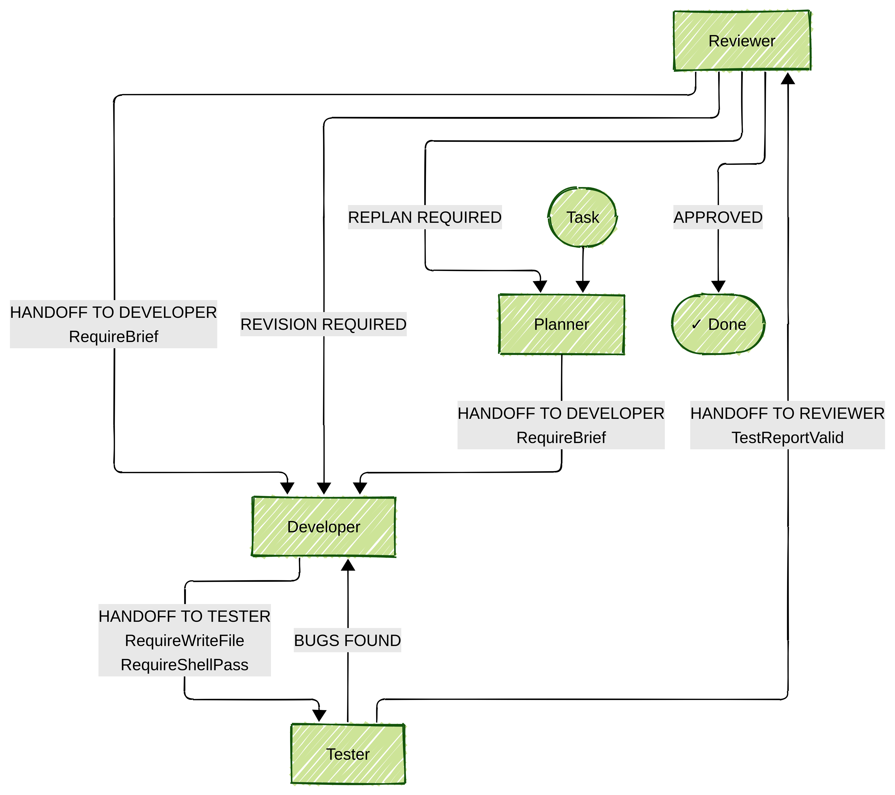
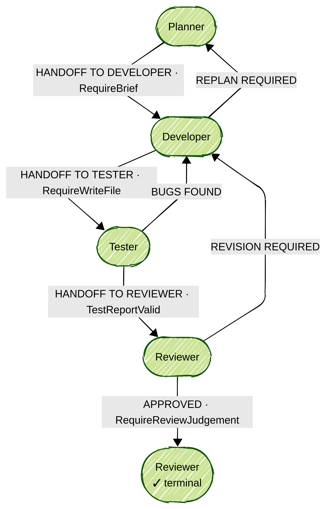
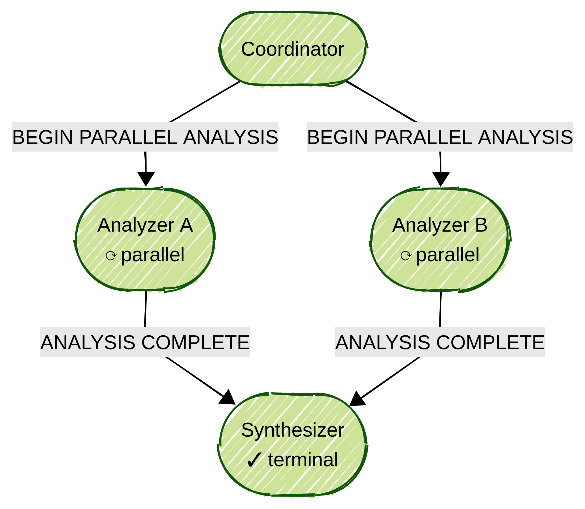
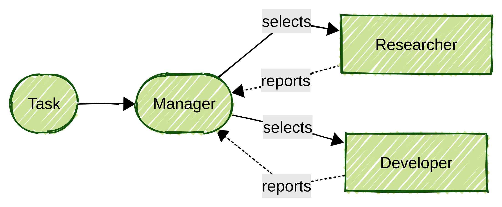

# Fuseraft CLI

A .NET multi-agent orchestration framework built on [Microsoft Agent Framework](https://github.com/microsoft/agents). Define a team of AI agents in a YAML config and coordinate them via keyword routing, state machine routing, declarative directed-graph routing, LLM-based selection, or fully autonomous [Magentic](https://arxiv.org/abs/2411.04468) orchestration. Works with Anthropic, xAI, OpenAI, Azure OpenAI, Ollama, and any OpenAI-compatible provider. Agents can be local or remote — the [A2A protocol](https://a2a-protocol.org/) lets you federate agent slots to independently hosted services.

> **Early stage.** Functional but not battle-tested — best suited for experimentation and automation of well-defined tasks.

---

## Architecture

Pipelines range from a single task-routed assistant:



...to multi-agent workflows with conditional keyword routing and anti-hallucination validators enforced at every handoff:



...to declarative directed-graph pipelines where back-edges express review cycles without duplicating states:



...to parallel fan-out/fan-in where a coordinator spawns concurrent workers that merge into a single downstream node:



...to fully autonomous [Magentic](https://arxiv.org/abs/2411.04468) orchestration where a Manager dynamically selects agents and collects their reports:



---

## Prerequisites

- [.NET 10 SDK](https://dot.net)
- An API key for your chosen provider (e.g. `XAI_API_KEY` for xAI)

---

## Quick start

```bash
# Build
./build.sh          # Linux / macOS
.\build.ps1         # Windows

# Generate a config from a template (interactive wizard)
./bin/fuseraft init

# Or pick a template directly
./bin/fuseraft init --template dev-team --model claude-sonnet-4-6
./bin/fuseraft init --template graph          # directed-graph pipeline with parallel fan-out
./bin/fuseraft init --template designer       # AI-assisted config designer

# Run against a YAML config
./bin/fuseraft run -c config/orchestration.yaml "Build a REST API in Go with JWT authentication"

# Resume the most recent incomplete session
./bin/fuseraft run --resume

# Validate a config before running; --diagram prints a Mermaid flowchart
./bin/fuseraft validate config/orchestration.yaml
./bin/fuseraft validate config/orchestration.yaml --diagram
```

---

## Features

- Coordinates any number of agents via keyword routing, state machine routing, declarative directed-graph routing (with parallel fan-out/fan-in), LLM-based selection, or fully autonomous Magentic orchestration
- Agents can be declared inline or as standalone `AgentFile` YAML files — reuse and version agent definitions independently across configs
- Gives each agent access to tools: filesystem, shell, git, HTTP, JSON, search, Docker sandboxes, MCP servers, persistent scratchpad, and a shared chatroom
- Federates agent slots to remote services via the [A2A protocol](https://a2a-protocol.org/) — remote agents participate identically to local ones
- Checkpoints after every turn so sessions can always be resumed exactly where they left off
- Tracks token usage per turn; enforces per-model context caps via `MaxContextTokens` and a session-wide hard stop via `MaxTotalTokens`
- Blocks handoffs with routing validators unless evidence of real progress is present on disk
- Sandboxes agent file and shell access to a configured directory tree
- Applies per-agent execution rings, prompt injection detection, circuit breaker, and a hash-chain audit log via the Agent Governance Toolkit
- Supports mixing any combination of LLM providers per agent
- Streams agent turns to a browser-based DevUI (`--devui`) for real-time session visualization
- Includes an interactive **Orchestration Designer** (`fuseraft init --template designer`) — describe your use case and get a validated config back

---

## Documentation

| Doc | What it covers |
|-----|----------------|
| [Getting Started](docs/getting-started.md) | Prerequisites, build, first run |
| [CLI Reference](docs/cli-reference.md) | All commands and flags |
| [Configuration](docs/configuration.md) | Full config schema (YAML and JSON) |
| [Models & Providers](docs/models.md) | Model configuration and provider auto-detection |
| [Plugins](docs/plugins.md) | All built-in tools agents can call |
| [Strategies](docs/strategies.md) | Selection and termination strategies |
| [Routing Validators](docs/validators.md) | Anti-hallucination handoff guards |
| [Harness Engineering](docs/harness-engineering.md) | Designing orchestration configs that enforce real progress mechanically |
| [MCP Integration](docs/mcp.md) | Connecting external MCP servers |
| [Security & Sandbox](docs/security.md) | File and network containment |
| [Governance](docs/governance.md) | Execution rings, audit log, circuit breaker, SLO tracking |
| [Context Store](docs/context.md) | Importing files and directories into the session context |
| [Sessions](docs/sessions.md) | Resumption, HITL, cost tracking, compaction |
| [Examples](docs/examples.md) | Ready-to-use config examples |
| [Design](docs/design.md) | Architecture, layer map, MAF usage, and decision log |

---

## VS Code Extension

The [Fuseraft VS Code extension](https://github.com/fuseraft/fuseraft-vscode) brings the CLI into your editor:

- Activity bar panel with **Run Task**, **Sessions**, **Configs**, and **Context** views
- CodeLens on config files — run, validate, or diagram without leaving the editor
- Command palette integration for all common CLI commands
- YAML/JSON IntelliSense with schema validation for config files
- Session transcript viewer and real-time DevUI launcher

---

## License

MIT
