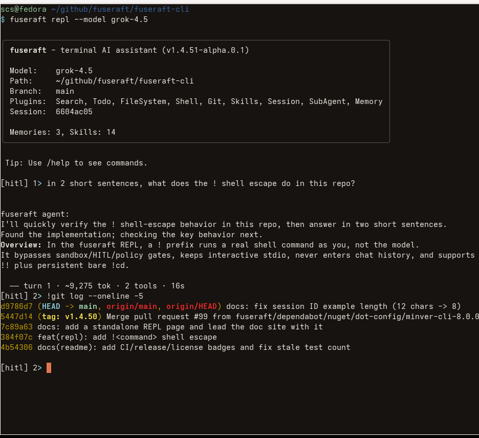
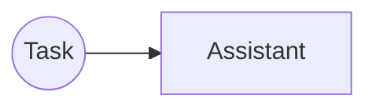
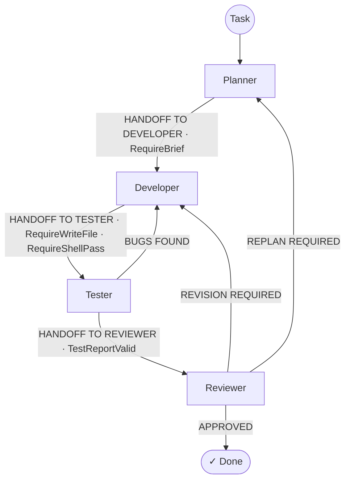
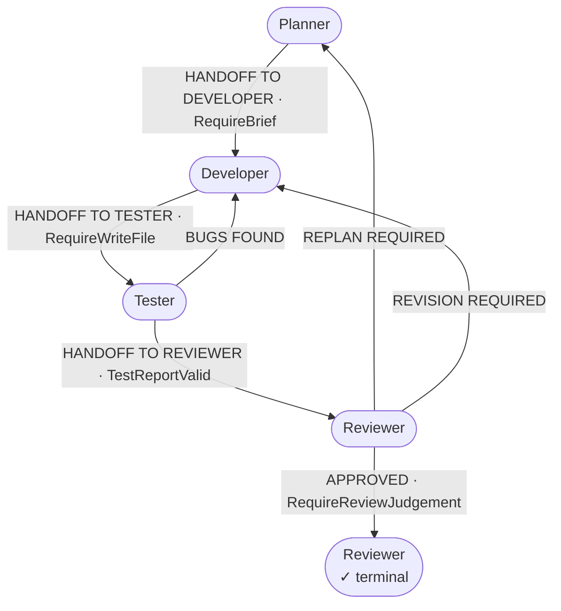
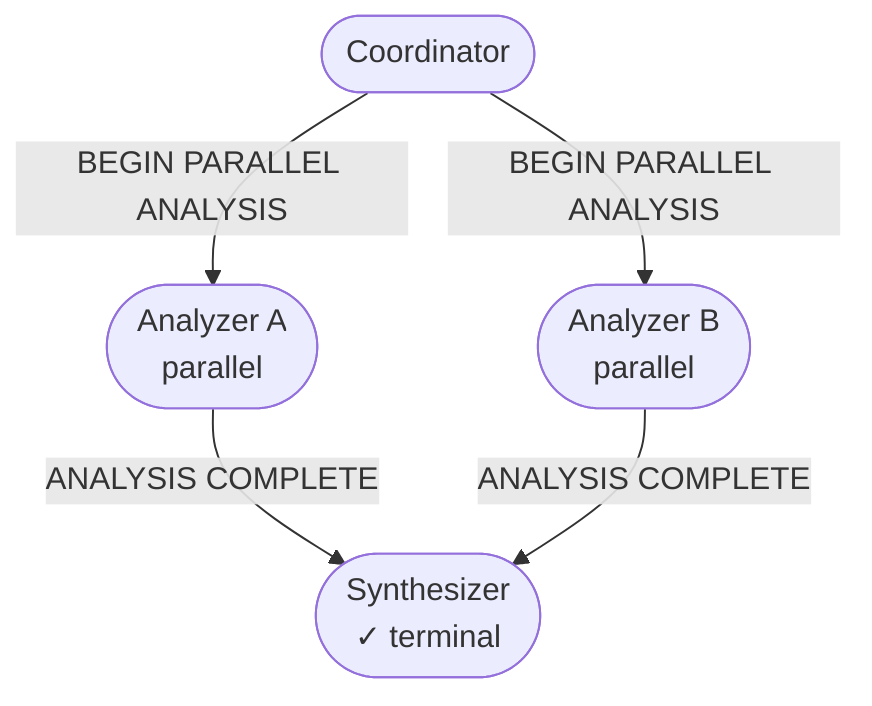
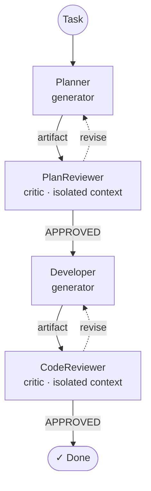
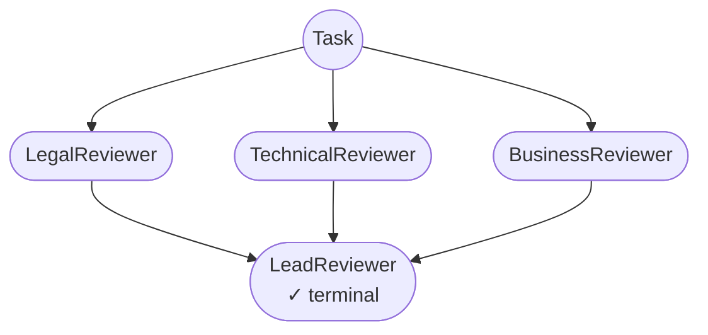
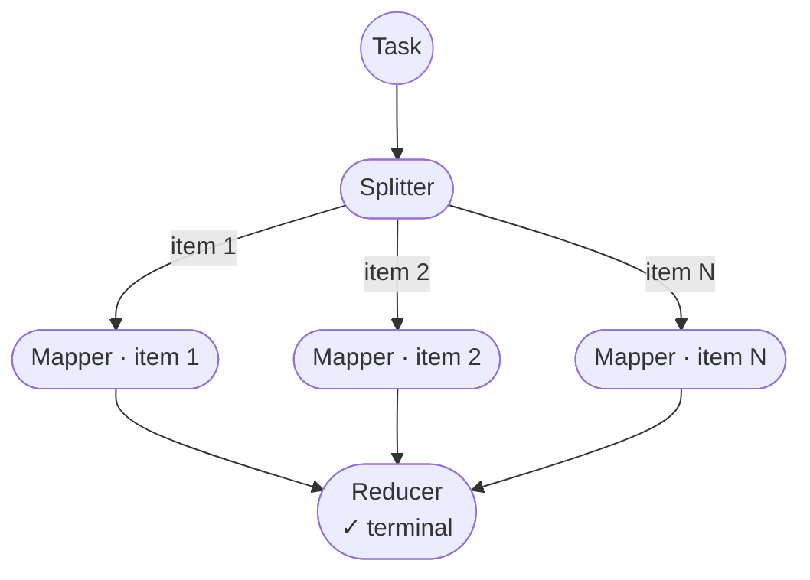
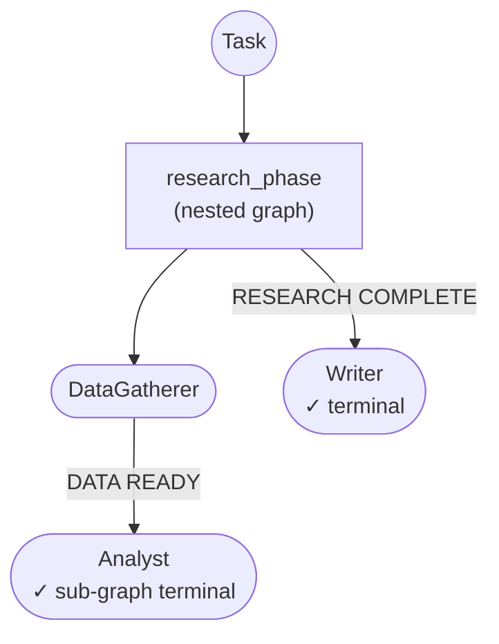

# fuseraft



fuseraft runs teams of AI agents and mechanically enforces that they did what they claim before advancing the pipeline.

Validators inspect tool-call records, file presence, and shell exit codes — not agent assertions. Claims are not evidence; artifacts and command results are. This is runtime verification: observable behavior, not self-reported outcomes.

Define pipelines in YAML with agents, routing strategy, and contracts. Works with Anthropic, xAI, OpenAI, Azure, Ollama, and any OpenAI-compatible provider. Built on Microsoft Agent Framework.

---

## Quick start

```bash
# Open an interactive REPL session — no config needed
fuseraft

# Interactive wizard — describe your use case and get a config back
fuseraft init

# Or start from a built-in template
fuseraft init --template solo           # single capable agent — the simplest starting point
fuseraft init --template pipeline       # Planner → Developer → Tester → Reviewer (graph)
fuseraft init --template swe            # full SWE pipeline with evidence contracts + Verifier
fuseraft init --template debate         # adversarial deliberation for decisions and design reviews

# Run a session
fuseraft run -c .fuseraft/config/orchestration.yaml "Build a REST API in Go with JWT authentication"

# Anchor all agents to a spec file as the authoritative source of truth
fuseraft run --spec spec.md
fuseraft run -c .fuseraft/config/orchestration.yaml --spec spec.md "Implement the specification"

# Resume the most recent incomplete session
fuseraft run --resume

# Validate a config — add --diagram for a Mermaid flowchart preview
fuseraft validate .fuseraft/config/orchestration.yaml --diagram
```

---

## Install

Prebuilt binaries are self-contained — no .NET installation required.

**Linux / macOS**

```bash
curl -fsSL https://raw.githubusercontent.com/fuseraft/fuseraft-cli/main/install.sh | bash
```

Add `--system` to install to `/usr/local/bin` instead of `~/.local/bin`:

```bash
curl -fsSL https://raw.githubusercontent.com/fuseraft/fuseraft-cli/main/install.sh | bash -s -- --system
```

**Windows (PowerShell)**

```powershell
irm https://raw.githubusercontent.com/fuseraft/fuseraft-cli/main/install.ps1 | iex
```

Both scripts download the latest release from [GitHub Releases](https://github.com/fuseraft/fuseraft-cli/releases), place the binary on your `PATH`, and confirm with a `fuseraft --version` on completion.

**Manual download**

Grab the archive for your platform from [Releases](https://github.com/fuseraft/fuseraft-cli/releases), extract the binary, and place it on your `PATH`.

**Updates**

Once installed, keep fuseraft current with:

```bash
fuseraft update          # download and install the latest release
fuseraft update --check  # check without installing
```

On Windows, `fuseraft update` launches a separate `fuseraft-update.exe` process (included in the release archive) that waits for running fuseraft instances to exit before replacing the binary. On Linux and macOS the replacement is atomic and happens in place.

**Build from source**

Requires the [.NET 10 SDK](https://dot.net):

```bash
./build.sh          # Linux / macOS
.\build.ps1         # Windows
```

The binary lands in `./bin/`.

---

## Features

**Enforcement**
- Routing validators block handoffs until evidence exists on disk (`RequireBrief`, `RequireWriteFile`, `RequireShellPass`, `TestReportValid`, etc.)
- Change tracker logs every `write_file`, `shell_run`, and `git_commit` to a JSONL audit log
- Evidence contracts gate transitions with predicates: `FileExists`, `FilesWritten`, `CommandSucceeded`

**Coordination**
- Twelve routing modes: sequential (one-pass), round-robin (cycling), keyword, structured, state machine, graph (parallel fan-out + hierarchical sub-graphs), workflow (cycle-native graph compiled once per session), LLM, Magentic, adversarial generate→critique, map-reduce (parallel item processing), scatter-gather (broadcast + synthesize)
- Saga mode adds compensating rollback on failure
- Inline agents or reusable `AgentFile` YAML; mix providers in one pipeline
- Federate slots via A2A protocol

**Knowledge & Tools**
- Cross-session knowledge: ADRs, repository graph, provenance claims, objectives
- Architecture drift detection, knowledge life cycle GC
- Built-in [plugins](docs/plugins.md), Docker sandboxes, MCP servers, skills

**Reliability & Governance**
- Checkpoints after every turn; resume anywhere
- Token tracking, compaction, per-agent context specs
- Execution rings, prompt-injection detection, circuit breakers, rate limiting, SLO tracking, sandboxing, HITL
- Prompt injection scans, blocked calls recorded in audit logs
- Hash-chain audit logging, per-agent [decentralized identifiers](https://www.w3.org/TR/did-core/)

---

## Documentation

| Doc | Covers |
|-----|--------|
| [Getting Started](docs/getting-started.md) | Prerequisites, first run |
| [CLI Reference](docs/cli-reference.md) | Commands and flags |
| [Scripting & Automation](docs/scripting.md) | Running fuseraft from bash/Python, `--json` output, event-driven pipelines |
| [Configuration](docs/configuration.md) | YAML/JSON schema |
| [Models & Providers](docs/models.md) | Model configuration and provider auto-detection |
| [Plugins](docs/plugins.md) | All built-in tools agents can call |
| [Strategies](docs/strategies.md) | Selection and termination strategies |
| [Validators](docs/validators.md) | Anti-hallucination handoff guards |
| [Harness Engineering](docs/harness-engineering.md) | Configs that enforce real progress mechanically |
| [MCP Integration](docs/mcp.md) | Connecting external MCP servers |
| [Security & Sandbox](docs/security.md) | File and network containment |
| [Governance](docs/governance.md) | Execution rings, audit log, circuit breaker, SLO tracking |
| [Context Store](docs/context-store.md) | Importing files and directories into the session context |
| [Sessions](docs/sessions.md) | Resumption, HITL, cost tracking, compaction |
| [Knowledge Layer](docs/knowledge.md) | ADRs, graph, provenance |
| [Skills](docs/skills.md) | Portable skill packages, skill curation, and the cross-session skill index |
| [Examples](docs/examples.md) | Ready-to-use config examples |
| [Design](docs/design.md) | Architecture, layer map, MAF usage, and decision log |

---

## Pipeline topologies

**Simple**


**Keyword routing with validators**



**Declarative directed-graph pipelines**



...to parallel fan-out/fan-in where a coordinator spawns concurrent workers that merge into a single downstream node:



**Fully autonomous [Magentic](https://arxiv.org/abs/2411.04468) pipelines**


**Adversarial pipelines**:



**Scatter-gather (broadcast + synthesize)**



**Map-reduce (parallel item processing)**



**Hierarchical sub-graphs**



---

## VS Code Extension

The [fuseraft VS Code extension](https://github.com/fuseraft/fuseraft-vscode) brings the full CLI experience into your editor.

**Activity bar panel** — four persistent views:
- **Run Task** — compose a task, pick a config, set flags (`--hitl`, `--tools`, `--verbose`, `--devui`), and launch. Each task opens in its own named terminal; multiple tasks can run simultaneously.
- **Sessions** — lists sessions scoped to your workspace with status, age, and task preview. Click to resume; preview icon opens a formatted transcript with per-turn token usage.
- **Configs** — auto-discovers every fuseraft config in your workspace. Click to open, or hit **+** to run the Initialize Config wizard.
- **Context** — manages reference material agents can access during sessions. Import files or folders; they're stored in `.fuseraft/context/` and available to any session in the workspace.

**CodeLens on config files** — three inline actions appear above the first line of any config:

```
▶ Run Task   ✓ Validate   ⎇ Diagram
```

**Task files** — right-click any `.md` or `.txt` file in the explorer or editor to run it directly as a fuseraft task.

**REPL** — `fuseraft: Open REPL` starts an interactive single-agent chat session without a config file.

**YAML / JSON IntelliSense** — full JSON Schema for fuseraft configs ships with the extension. Autocomplete, inline docs, and validation for every field.

**Status bar** — a persistent `fuseraft` button always visible at the bottom of the editor.

---

## Contributing

Contributions are welcome — bug fixes, new plugins, config examples, documentation, and new ideas. See [CONTRIBUTING.md](CONTRIBUTING.md) to get started.

---

## License

MIT
